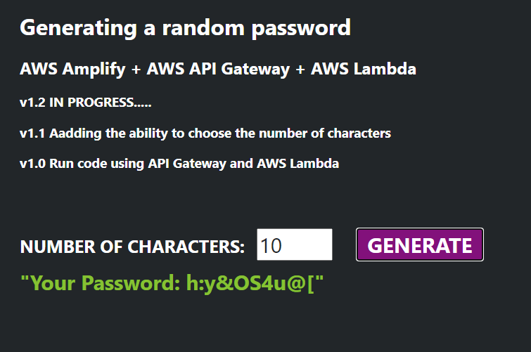

A simple application that, based on the given number of characters, generates a random password from a set of letters, numbers and special characters

The Amplify service was used to host the page, Api Gateway to post values ​​from the user and Lambda to execute the code.

